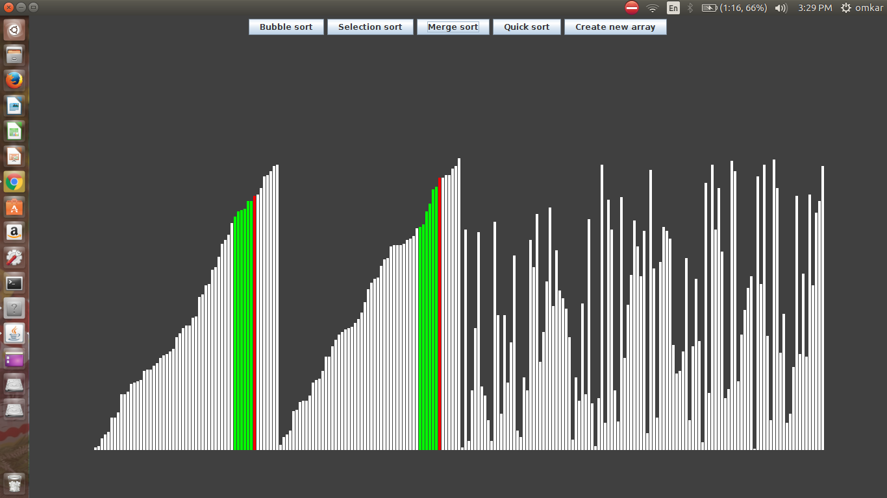

# sort-visualizer
## purpose
This project's purpose was to help me understand how to implement sorting algorithms and how sorting algorithms handle data in real time.

## Features 
This project features sorts including:
1) Bubble sort
2) Selection sort
3) Merge sort
4) Quick sort
##### create new array feature is to generate random array, after sorting is done
